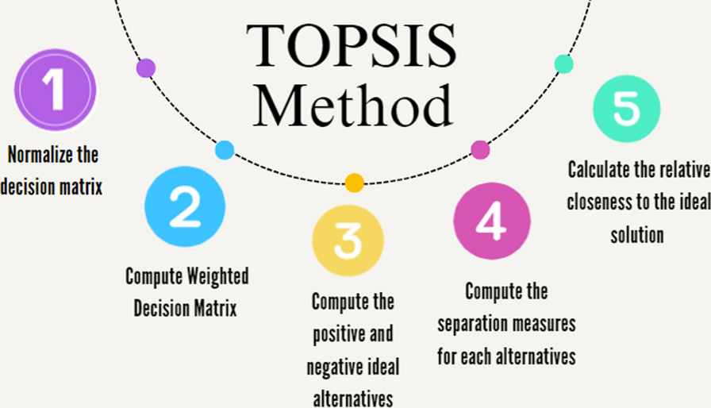

# 📡 TOPSIS Integrated Neutrosophic MCDM for IoT-Based Enterprises

> A decision-making framework combining Neutrosophic Set Theory with TOPSIS to improve IoT enterprise evaluations.

---

## 📚 Abstract

This project presents a hybrid Multi-Criteria Decision Making (MCDM) model integrating **Neutrosophic Set Theory** with **TOPSIS** for more robust decision-making in **IoT-based enterprise environments**. It handles uncertainty, vagueness, and conflicting evaluations more effectively than traditional methods.

---

## 🔍 Key Features

- ✅ Handles uncertainty via **Neutrosophic Sets**
- ⚖️ Uses **TOPSIS** for distance-based alternative ranking
- 📶 Evaluates key IoT criteria: Security, Value, Intelligence, Transparency, Connectivity
- 📊 Real-world case study included

---

## 📌 Methodology Overview

### 🔷 Framework Overview

1. **Problem Structuring**
2. **Criteria Weighting (Trapezoidal Neutrosophic)**
3. **Decision Matrix Construction**
4. **TOPSIS-Based Ranking**

---

## 📊 Comparative Analysis

| Approach | Uncertainty Modeling | Ranking Method | Verdict |
|----------|----------------------|----------------|---------|
| AHP (Triangular) | Medium | Subjective | ❌ |
| Proposed (Trapezoidal + TOPSIS) | High | Objective | ✅ |

---

## 📈 Sample Result (TOPSIS Score)

| Alternative | Score | Rank |
|-------------|-------|------|
| Spark       | 0.597 | 🥇 Best |
| Knime       | 0.487 | �� |
| Hadoop      | 0.487 | 🥈 |

---

## 🧠 Technologies Used

- Python (for TOPSIS calculations)
- NumPy & Pandas
- Matplotlib (for plotting results)
- Markdown for documentation

---

## 📝 Authors

- **Aayushman Gupta** – [12211098]
- **Satyam Sahu** – [12211070]

> Supervised by **Dr. Mukesh Mann**, IIIT Sonepat

---

## 🗂️ File Structure

